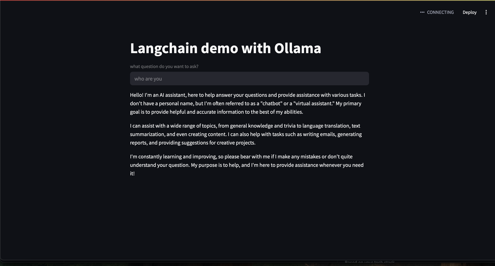

# LangChain-Ollama Integration

This project demonstrates the integration of LangChain with Ollama, allowing you to run large language models locally using LangChain's powerful framework.

## Features

- Local LLM integration using Ollama
- LangChain framework implementation
- Environment variable configuration
- Simple and efficient setup

## Prerequisites

- Python 3.8 or higher
- Ollama installed on your system
- Git

## Installation

1. Clone the repository:
```bash
git clone https://github.com/yourusername/LangChain-Ollama.git
cd LangChain-Ollama
```

2. Create and activate a virtual environment:
```bash
python -m venv venv
source venv/bin/activate  # On Windows, use: venv\Scripts\activate
```

3. Install the required dependencies:
```bash
pip install -r requirements.txt
```

4. Set up your environment variables:
Create a `.env` file in the root directory and add:
```
LANGCHAIN_API_KEY="your_langchain_api_key"
LANGCHAIN_PROJECT="your_project_name"
```

## Usage

1. Make sure Ollama is running on your system
2. Run the application:
```bash
python Ollama/app.py
```

## Screenshots



*Example output of the LangChain-Ollama integration*

## Project Structure

```
LangChain-Ollama/
├── Ollama/
│   └── app.py
├── requirements.txt
├── .env
├── screenshots/
│   └── app_output.png
└── README.md
```

## Dependencies

- langchain
- langchain-community
- python-dotenv
- Other dependencies listed in requirements.txt

## Contributing

1. Fork the repository
2. Create your feature branch (`git checkout -b feature/AmazingFeature`)
3. Commit your changes (`git commit -m 'Add some AmazingFeature'`)
4. Push to the branch (`git push origin feature/AmazingFeature`)
5. Open a Pull Request

## License

This project is licensed under the MIT License - see the LICENSE file for details.

## Acknowledgments

- LangChain team for their amazing framework
- Ollama team for making local LLMs accessible 